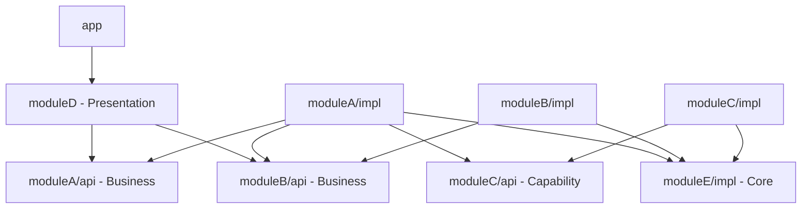

# Koin Multi-Module Android Project

一个基于Koin依赖注入框架的Android多模块项目，展示了现代Android应用的模块化架构设计和最佳实践。

## 🏗️ 项目架构

### 架构概览

本项目采用分层模块化架构，遵循Clean Architecture原则，通过Koin实现依赖注入，确保各模块间的松耦合和高内聚。

```
koin-multi-module/
├── app/                           # 主应用模块
├── components-presentation/       # 表现层组件
│   └── moduleD/                  # UI模块
├── components-business/          # 业务层组件
│   ├── moduleA/                  # 业务模块A
│   │   ├── api/                  # 对外接口
│   │   ├── impl/                 # 具体实现
│   │   └── sample/               # 示例代码
│   └── moduleB/                  # 业务模块B
│       ├── api/                  # 对外接口
│       └── impl/                 # 具体实现
├── components-capability/        # 能力层组件
│   └── moduleC/                  # 通用能力模块
│       ├── api/                  # 对外接口
│       └── impl/                 # 具体实现
├── components-core/              # 核心层组件
│   └── moduleE/                  # 核心服务模块
│       ├── impl/                 # 核心实现
│       └── sample/               # 示例代码
├── components-build/             # 构建工具组件
│   ├── annotation/               # 注解处理器
│   └── processor/                # 编译时处理器
└── tools/                        # 构建工具和配置
    └── gradle/                   # Gradle配置文件
```

### 🎯 设计思想

#### 1. 分层架构设计

**表现层 (Presentation Layer)**

- 负责UI展示和用户交互
- 包含Activity、Fragment、ViewModel等
- 依赖业务层接口，不直接依赖具体实现

**业务层 (Business Layer)**

- 包含核心业务逻辑和用例
- 通过API模块暴露接口，通过Impl模块提供实现
- 实现业务规则和数据处理逻辑

**能力层 (Capability Layer)**

- 提供通用能力和工具类
- 为业务层提供基础服务支持
- 包含网络、存储、工具类等

**核心层 (Core Layer)**

- 提供最基础的核心服务
- 包含应用级别的通用组件
- 为其他层提供基础设施支持

#### 2. 模块化设计原则

**API/Impl分离**

- API模块：定义接口契约，供其他模块依赖
- Impl模块：提供具体实现，通过Koin注入
- 实现了接口与实现的解耦，提高了可测试性

**依赖方向控制**

- 高层模块不依赖低层模块，都依赖于抽象
- 抽象不依赖细节，细节依赖抽象
- 通过依赖注入实现控制反转

**单一职责原则**

- 每个模块都有明确的职责边界
- 模块内部高内聚，模块间低耦合
- 便于维护和扩展

#### 3. Koin依赖注入架构

**模块化注入**
```kotlin
// 每个模块定义自己的Koin模块
val moduleAModule = module {
    single<IUserService> { UserServiceImpl(get(), get()) }
    factory<INameService> { INameServiceFactory.create() }
}
```

**分层注入**

- 表现层注入ViewModel和UseCase
- 业务层注入Repository和Service
- 数据层注入DataSource和API

**作用域管理**

- Single：单例模式，应用级别共享
- Factory：每次注入创建新实例
- Scoped：特定作用域内共享

### 🔧 构建配置架构

#### 统一配置管理

项目采用分层Gradle配置架构，实现配置的统一管理和复用：

```
tools/gradle/
├── common-android-config.gradle    # Android应用配置
├── common-library-config.gradle    # Android库配置
└── common-processor-config.gradle  # Koin处理器配置
```

**Android应用配置 (common-android-config.gradle)**

- Android Application模块专用配置
- 包含完整的Android SDK版本管理
- 统一的Java/Kotlin编译配置
- 应用级通用依赖（Kotlin标准库、Core KTX、Koin等）
- 构建类型和编译选项配置

**Android库配置 (common-library-config.gradle)**

- Android Library模块专用配置
- 与应用配置保持一致的SDK版本和编译配置
- 添加了Lint配置以避免构建中断
- 库模块通用依赖管理
- 不包含applicationId等应用特有配置

**Koin处理器配置 (common-processor-config.gradle)**

- Koin注解处理器统一配置
- KSP (Kotlin Symbol Processing) 依赖管理
- 注解版本和处理器版本统一控制
- 支持本地开发和远程依赖两种模式
- 自动应用KSP配置和参数设置

#### 使用方式

**Android应用模块 (app)**

```gradle
// 应用Android应用配置
apply from: rootProject.file('tools/gradle/common-android-config.gradle')
```

**Android库模块 (各业务模块)**

```gradle
// 应用Android库配置
apply from: rootProject.file('tools/gradle/common-library-config.gradle')
// 如需Koin注解处理，额外应用处理器配置
apply from: rootProject.file('tools/gradle/common-processor-config.gradle')
```

#### 配置优势

1. **版本统一管理**: 所有模块使用相同的SDK版本和依赖版本
2. **配置复用**: 避免在每个模块中重复配置相同内容
3. **维护便利**: 版本升级只需修改配置文件，自动应用到所有模块
4. **类型区分**: 针对不同类型模块提供专门的配置
5. **灵活组合**: 模块可根据需要选择性应用不同配置

### 📦 模块依赖关系



### 🛠️ 技术栈

**核心框架**

- **Koin 3.4.0**: 依赖注入框架
- **Kotlin 1.8.22**: 主要开发语言
- **Android Gradle Plugin 7.1.3**: 构建工具

**Android组件**

- **AndroidX**: 现代Android开发库
- **Material Design**: UI设计规范
- **ConstraintLayout**: 布局管理

**构建工具**

- **KSP (Kotlin Symbol Processing)**: 注解处理
- **Gradle**: 构建系统
- **ProGuard**: 代码混淆

### 🚀 快速开始

#### 环境要求

- Android Studio Arctic Fox或更高版本
- JDK 8或更高版本
- Android SDK API 21+
- Gradle 7.2+

#### 构建项目

```bash
# 克隆项目
git clone <repository-url>
cd koin-multi-module

# 构建项目
./gradlew build

# 运行应用
./gradlew :app:installDebug
```

#### 添加新模块

1. **创建模块结构**

```
components-business/newModule/
├── api/
│   └── build.gradle
└── impl/
    └── build.gradle
```

2. **配置build.gradle**
```gradle
// API模块
apply from: rootProject.file('tools/gradle/common-library-config.gradle')

// Impl模块
apply from: rootProject.file('tools/gradle/common-library-config.gradle')
apply from: rootProject.file('tools/gradle/koin-dependencies.gradle')
```

3. **定义Koin模块**
```kotlin
val newModule = module {
    single<INewService> { NewServiceImpl() }
}
```

### 📋 开发规范

#### 模块命名规范

- **API模块**: 定义接口，以`I`开头命名接口
- **Impl模块**: 实现接口，以`Impl`结尾命名实现类
- **包名**: 遵循`com.example.module.{layer}.{module}`格式

#### 依赖注入规范

```kotlin
// 接口定义
interface IUserService {
    fun getUser(id: String): User
}

// 实现类
class UserServiceImpl(
    private val repository: IUserRepository,
    private val validator: IValidator
) : IUserService {
    override fun getUser(id: String): User {
        // 实现逻辑
    }
}

// Koin模块定义
val userModule = module {
    single<IUserService> { UserServiceImpl(get(), get()) }
}
```

#### 测试策略

- **单元测试**: 针对业务逻辑和工具类
- **集成测试**: 测试模块间交互
- **UI测试**: 验证用户界面功能

### 🔍 架构优势

#### 1. 可维护性

- 模块化设计便于定位和修复问题
- 清晰的依赖关系降低维护成本
- 统一的配置管理简化项目维护

#### 2. 可扩展性

- 新功能可以独立模块开发
- 接口抽象支持多种实现方式
- 依赖注入支持运行时替换实现

#### 3. 可测试性

- 接口抽象便于Mock测试
- 依赖注入支持测试替身
- 模块隔离降低测试复杂度

#### 4. 团队协作

- 模块边界清晰，支持并行开发
- 接口契约明确，减少沟通成本
- 统一规范提高代码质量

### 📚 相关文档

- [Koin官方文档](https://insert-koin.io/)
- [Android架构指南](https://developer.android.com/jetpack/guide)
- [Clean Architecture](https://blog.cleancoder.com/uncle-bob/2012/08/13/the-clean-architecture.html)
- [Gradle构建指南](https://docs.gradle.org/current/userguide/userguide.html)

### 🤝 贡献指南

1. Fork项目
2. 创建功能分支 (`git checkout -b feature/AmazingFeature`)
3. 提交更改 (`git commit -m 'Add some AmazingFeature'`)
4. 推送到分支 (`git push origin feature/AmazingFeature`)
5. 开启Pull Request

### 📄 许可证

本项目采用MIT许可证 - 查看 [LICENSE](LICENSE) 文件了解详情。

### 📞 联系方式

如有问题或建议，请通过以下方式联系：

- 提交Issue: [GitHub Issues](https://github.com/your-repo/issues)
- 邮箱: your-email@example.com

---

**注意**: 本项目仅用于学习和演示目的，展示Android多模块架构和Koin依赖注入的最佳实践。